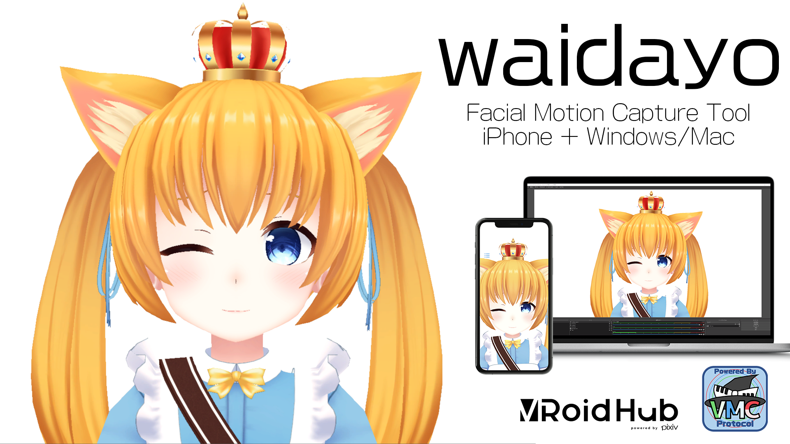

# はじめに
- waidayoはVRMに対応した3D VTuber向けのフェイシャルモーションキャプチャシステムです。
- iPhoneで表情をキャプチャし、PCへモーションを転送することができます。
- VMC Protocolに対応したオープンなフェイシャルモーションキャプチャーツールです。
- わからないことや要望があれば作者のdiscord、waidayo(face2vmc) チャンネルで質問しよう！
    - https://discord.com/invite/GrZWt6U

# 必要なもの
- 顔認証機能のついたiPhone/iPadが必要です
- iPhoneからの情報を受信するPC（WindowsまたはMac）
- iPhoneとパソコンは同じネットワークに接続されている必要があります

# waidayoをおすすめする理由
- 無料
- VMC Protocolへの対応（表情のみを送信してVMCと合成することも可能）
- 特殊ブレンドシェイプに対応（舌、ほっぺ、眉など）
- iPhone側で表情を認識するため配信用PCの負荷軽減
- 自分自身のアバターを見ながら配信が可能

# 機能
- アバターの変更
    - iPhoneへ直接データを転送する方法とVRoid Hubからデータをダウンロードする２つの方法があります。
- 表情と顔の向きをPCへ送信する：waidayoモード
    - waidayoとwaidayo for PCだけで配信することができます。
- 表情のみをPCへ送信する：Face2VMCモード
    - バーチャルモーションキャプチャーと連携することができます。

# 使い方（手持ちのVRMファイルを利用）
- iPhone版アプリをダウンロードする
    - Apple App Storeからダウンロードしてね
    - リンク　近日配布予定（メタデータ修正中）
    - 急ぎの方はdiscordでβテスターとして登録します
    
- Windows/Mac版アプリをダウンロードする
    - https://nmch1222.booth.pm/items/1779185

- VRMファイルを用意して"default.vrm"とリネームしておく
- iTunesを使ってiPhoneへVRMファイルを転送する
    - https://support.apple.com/ja-jp/HT201301
- PCのCドライブ直下へ用意したVRMファイルを置く
    - Macの場合はDocument直下
- iPhone版アプリへPCのIPアドレスを登録する
    - 設定＞Send Motion IP Addressから変更できるよ！

# バーチャルモーションキャプチャーに表情データのみを送る（Face2VMCモード）
- iPhone版waidayoの設定画面で「Face Only(With VMC)」を選択
- PC版waidayoの画面を閉じて、ばもきゃを起動（ばもきゃは先行リリース品（FANBOXで300円以上の支援）が必要）
    - https://akira.fanbox.cc/
- ファイヤーウォールの通信確認画面が出た場合は「許可」を押下
- ばもきゃのコントロールパネルにて「詳細設定」を押し詳細設定画面を開く
- 設定画面が出たら「外部からのモーション受信を有効にする」にチェックを入れて「適用」ボタンを押す。
    - （Port番号はデフォルトで入っている「39540」でOK）

# フェイシャルキャプチャ対象となるBlendshapeProxyを増やす
- waidayoではVRM規格で定義されているBlendshapeに加えて以下が利用可能です
    - EYEBROW_ANGRY　おこり眉（Syncモード）
    - EYEBROW_ANGRY_L　おこり眉L（Separateモード）
    - EYEBROW_ANGRY_R　おこり眉R（Separateモード）
    - EYEBROW_SORROW　しょんぼり眉（Syncモード）
    - EYEBROW_SORROW_L　しょんぼり眉L（Separateモード）
    - EYEBROW_SORROW_R　しょんぼり眉R（Separateモード）
    - TONGUE_OUT　舌を出す
    - PUKUU　ほっぺぷくー
    
- 舌を出す、ほっぺぷくーは別の表情のトリガーとして使うことも可能です
    - 例）BlendshapeProxyの"PUKUU"に「＞＜」や「白目」を登録する

# 注意事項
- waidayoではVRMの作成に利用するUniVRMはVersion0.53の利用を推奨しています
- iPhone版とPC版で同じボーン構造、ブレンドシェイプ情報を持つモデルデータを使う必要があります
    - ＝PC側はどれだけ魔改造しても良い（HDRP対応やVRM標準外シェーダーの適用など）
- VRMファイルをインポートした場合、常に最優先で表示されます。
    - アプリ内蔵アバター、VRoid Hub連携機能でロードしたアバターはアプリケーション保持されません。

# おすすめのスマホ固定具
- waidayoモード
    - Lightning端子が同時に使えるようにスリットが開いているスタンドがおすすめです
    - https://www.amazon.co.jp/dp/B082K51CP5/ref=cm_sw_r_tw_dp_U_x_KNtWEb5G3KS1G

- Face2VMCモード
    - ネックホルダー型のものがおすすめです
    - https://www.amazon.co.jp/dp/B07MLQ7XSR/ref=cm_sw_r_tw_dp_U_x_7ItWEbXKR67ZR

# 補足
- 本アプリケーションは個人法人を問わず無償で商用利用していただくことが可能です
    
# 今後のアップデート予定
- モデルリスト（AppStore審査暫定対応のため簡易的な表示になっています）
    - 現在の実装：アプリ起動時にdefault.vrmを検出した場合は優先表示
    - アップデート予定：複数のVRMに対応
- エモート機能

# 謝辞
- iPhone版アプリに標準搭載のアバターはこよりちゃん制作のフィリナちゃんを使用させて頂いています（使用許諾済み）
    - 気に入ったら買ってね https://nagatorokoyori.booth.pm/items/1577042
    - こよりちゃん https://twitter.com/Nagatoro_Koyori
- iPhone版アプリに標準搭載の切替用アバターはVRoidサンプルモデルのViviちゃんを使用させて頂いています（CC0）
    - Vivi紹介ページ https://vroid.pixiv.help/hc/ja/articles/360014900273-%E3%83%93%E3%83%93-Vivi
- iPhone版アプリのリリースにあたり協力いただいた方々
    - あきらさん https://twitter.com/sh_akira
        - ばもきゃ側のFace2VMCモード対応、アプリリリース作業
    - せぐふぉさん https://twitter.com/Seg_Faul
        - 通信処理の大半
        
# 作者について
- Twitter https://twitter.com/nmch1222
- YouTube https://www.youtube.com/c/nmch1222
- FANBOX https://nmch1222.fanbox.cc/
    
