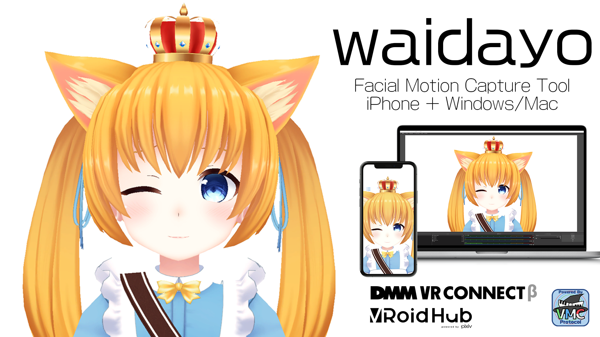

# [Support is discord only!](https://discord.com/invite/GrZWt6U)

# [waidayo How to use Wiki](https://github.com/nmchan/waidayo/wiki)

# はじめに/Introduction
- waidayoはVRMに対応した3D VTuber向けのフェイシャルモーションキャプチャシステムです。
- waidayo is a facial motion capture system for 3D VTubers that supports VRM.
- 
- iPhoneで表情をキャプチャし、PCへモーションを転送することができます。
- ただし、本システム自体の販売や再販行為は禁止します。
- You can capture facial expressions with your iPhone and transfer the motion to your PC.
- However, the sale or resale of this system itself is prohibited.
- 
- 本アプリケーションは個人法人を問わず無償で商用利用していただくことが可能です
- This application can be used for commercial purposes free of charge by any individual or corporation.
- 
- わからないことや要望があれば作者のdiscord、waidayo(face2vmc) チャンネルで質問しよう！
- If you have any questions or requests, please feel free to ask on the author's discord or waidayo(face2vmc) channel!
    - https://discord.com/invite/GrZWt6U

# 必要なもの/What you need
- A12 Bionic以降のチップが搭載されたiPhone/iPad（SE2でも動くよ！！！）
- iPhone/iPad with A12 Bionic or later chip (SE2 will work too!!!)
- 
- iPhoneからの情報を受信するPC（WindowsまたはMac）
- PC (Windows or Mac) to receive information from the iPhone
- 
- iPhoneとパソコンは同じネットワークに接続されている必要があります
- iPhone and PC must be connected to the same network

# waidayoをおすすめする理由/Why I recommend waidayo?
- 無料
- Free of charge
- 
- VMC Protocolへの対応（表情のみを送信してVMCと合成することも可能）
- Support for VMC Protocol (only facial expressions can be sent and combined with VMC)
- 
- 特殊ブレンドシェイプに対応（舌、ほっぺ、眉など）
- Support for special blendshapes (tongue, cheeks, eyebrows, etc.)
- 
- iPhone側で表情を認識するため配信用PCの負荷軽減
- The iPhone recognizes facial expressions, reducing the load on the PC for distribution.
- 
- 自分自身のアバターを見ながら配信が可能
- You can see the results of facial expression recognition by looking at your avatar, not your gray uncle's avatar!

# 機能/Function
- アバターの変更
- Changing your avatar
    - iPhoneへ直接データを転送する方法とVRoid Hub、DMM VR Connectからデータをダウンロードする２つの方法があります。
    - There are two ways to transfer the data directly to your iPhone or download the data from VRoid Hub or DMM VR Connect.
- 表情と顔の向きをPCへ送信する：waidayoモード
- Sending facial expressions and face orientation to PC: waidayo mode
    - waidayoとwaidayo for PCを組み合わせることで配信することができます。
    - This mode can be used in combination with waidayo and waidayo for PC.
- 表情のみをPCへ送信する：Face2VMCモード
- Sending only facial expressions to the PC: Face2VMC mode
    - バーチャルモーションキャプチャーと連携することができます。
    - Can be used in conjunction with virtual motion capture.

# 使い方（手持ちのVRMファイルを利用）/How to use (using your VRM files)
- iOS版アプリをダウンロードする
- Download the app for iOS
    - 
    - https://apps.apple.com/jp/app/waidayo/id1513166077
    
- waidayo for PC (Windows/Mac版アプリ)をダウンロードする
- Download the viewer app for Windows/Mac
    - https://nmch1222.booth.pm/items/1779185

- VRMファイルを用意して"default.vrm"とリネームしておく
- Prepare a VRM file and rename it to "default.vrm".
    - 使用するVRMファイルの使用許諾についてよく確認し、自己責任でご利用ください
    - Please check the license agreement of the VRM file you use and use it at your own risk.
- iTunesを使ってiPhoneへVRMファイルを転送する
- Transfer the VRM file to your iPhone using iTunes
    - https://support.apple.com/ja-jp/HT201301
- Cドライブ直下（またはプログラムと同じフォルダ）へ用意したVRMファイルを置く
- Place the prepared VRM file directly under the C drive (or in the same folder as the program).
    - Macの場合はDocument直下
    - For Mac, only under Document.
- iPhone版アプリとPC版アプリを起動する
- Launch the iPhone app and the PC app.
    - 自動で接続されるよ！
    - They will be connected automatically!
    
- 補足）アンチエイリアス処理の設定を変更できるよ
- (Tip) You can change the anti-aliasing settings.
     - キーボード上部の数字キー(0,2,4,8)を押すと切り替わります
     - Press the number keys (0,2,4,8) on the top of the keyboard to change the settings.
    
# リリース履歴/Release History
- 1.1.0 2020/11/29
    - DMM VR Connectに対応

- 1.0.9 2020/10/05
    - iOS14環境で他の端末への自動接続機能が使用できない不具合を修正
    
- 1.0.8 2020/09/28
    - VRoid Hub経由のモデルデータが正常に読み込めない不具合を修正
    
- 1.0.6 2020/09/22
    - 対応Blendshapeの追加（口：いーの表情）

- 1.0.5 2020/07/05
    - アバターの口、舌の挙動を修正
    - 設定画面を更新（タブ追加）

- 1.0.4 2020/06/16
    - アバターの口の挙動を修正
    - 暗号化アバター（SEDSS）の転送機能

- 1.0.3 2020/06/11
    - デフォルトアバターの挙動を修正
    - デバイス探索機能を追加
- 1.0.2 2020/06/03
    - メニューボタン非表示機能
       - default.vrmを転送済みの時のみ有効化
       - 同じ場所にメニューボタンがあるので勘で押してください
    - 一部モデルで長時間利用時に腕が回転してしまう不具合を解消
    - 画面回転に対応
    - Head Offsetが正しく反映されない問題の修正
        - （設定項目を削除、後日リセットボタンを新設）
    - 一部のモデルで顔が暗くなってしまう問題を解決
    - 背景を黒にするダークモードを追加
- 1.0.1 2020/05/23
    - 認識外へ出た際の挙動を修正（アバターを完全に停止）
    - MirroringON時にBLINK_L/Rが反転しない
    - iPad版でサードパーティライセンス表示が見切れる
    - アイトラッキングオフ時の挙動修正
- 1.0.0 2020/05/20
    - 初版

# 謝辞/Acknowledgements
- iOSアプリに標準搭載のアバターはこよりちゃん制作のフィリナちゃんを使用させて頂いています（使用許諾済み）
- The standard avatar for the iOS app is Filina, created by Koyori-chan (licensed for use).
    - 気に入ったら買ってね/Please buy it if you like it.
    - https://nagatorokoyori.booth.pm/items/1577042
    - こよりちゃん/Koyori-chan
    - https://twitter.com/Nagatoro_Koyori
- iOSアプリに標準搭載の切替用アバターはVRoidサンプルモデルのViviちゃんを使用させて頂いています（CC0）
- Vivi, a VRoid sample model, is used as the standard avatar for switching in the iOS app (CC0).
    - Vivi紹介ページ/Vivi introduction page
    - https://vroid.pixiv.help/hc/ja/articles/360014900273-%E3%83%93%E3%83%93-Vivi
- iOSアプリのリリースにあたり協力いただいた方々
- People who helped us with the release of the iOS app
    - あきらさん/Akira-san
    - https://twitter.com/sh_akira
        - ばもきゃ側のFace2VMCモード対応、アプリリリース作業
        - VMC's support for Face2VMC mode and app release work
    - せぐふぉさん/Segment-san
    - https://twitter.com/Seg_Faul
        - 通信処理の大半
        - Most of the communication processing
        
# 注意事項/Notes
- iPhone版とPC版で同じボーン構造、ブレンドシェイプ情報を持つモデルデータを使う必要があります
- You need to use model data with the same bone structure and blendshape information for the iPhone and PC versions.
    - ＝PC側はどれだけ魔改造してもOK（HDRP対応やVRM標準外シェーダーの適用など）
    - This means that any changes can be made to the avatar displayed on the PC side (e.g., HDRP support, non-standard VRM shaders).
- VRMファイルをインポートした場合、常に最優先で表示されます。
- When a VRM file is imported, it is always given the highest priority.
    - アプリ内蔵アバター、VRoid Hub/DMM VR Connect連携機能でロードしたアバターは再起動時に保持されません。
    - The built-in avatars of the application and the avatars loaded by the VRoid Hub/DMM VR Connect collaboration function are not retained when the application is restarted.
- waidayoを有償頒布ソフトの機能として利用する場合は個別に相談お願いいたします。
- Please consult with us individually if you want to use waidayo as a function of the software to be distributed for a fee.
- 
        
# 作者について/About the author, nm-chan
- waidayoの開発はみなさまの反応が原動力です
- もしよければTwitterのフォローやFANBOX、Paetronなどご支援いただけますと嬉しいです
- Your feedback is the driving force behind the development of waidayo!
- If you would like to support us, please follow us on Twitter, FANBOX, Paetron, etc.
- Twitter https://twitter.com/nmch1222
- YouTube https://www.youtube.com/c/nmch1222
- FANBOX https://nmch1222.fanbox.cc/
- Patreon https://www.patreon.com/nmch1222?fan_landing=true
- 干芋（for Japanese Only） https://www.amazon.jp/hz/wishlist/ls/2YH7VGKBX5U3C?ref_=wl_share
    
